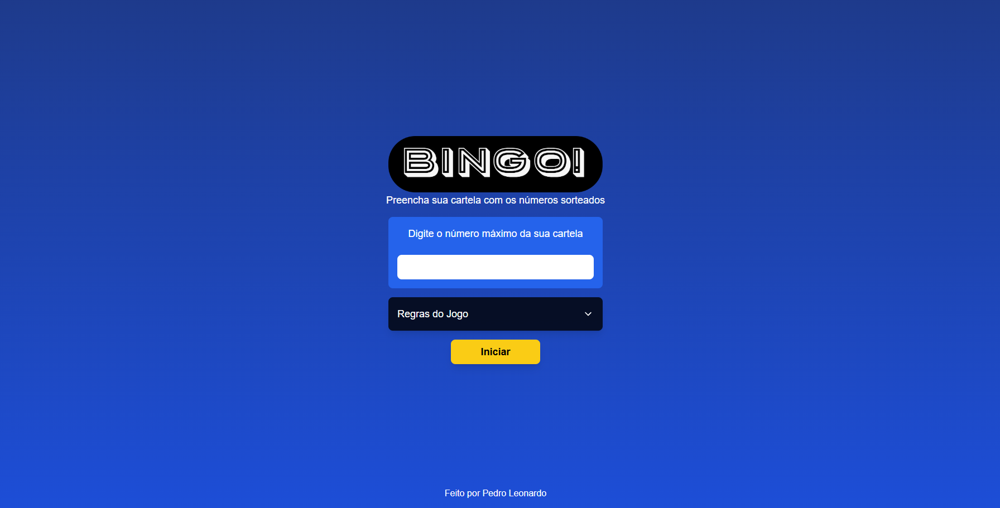

# BIngo!



> BIngo! é uma aplicação web que simula o tradicional jogo de bingo, permitindo que usuários definam parâmetros personalizados e acompanhem o sorteio de números em tempo real. O aplicativo é perfeito para se divertir em grupo ou simplesmente para diversão pessoal.


## 💻 Pré-requisitos

Antes de começar, verifique se você atendeu aos seguintes requisitos:

- Você instalou a versão mais recente do `<NodeJS>`
- Você tem uma máquina `<Windows / Linux / Mac>`.

## 🚀 Instalando <nome_do_projeto>

Para instalar o <nome_do_projeto>, siga estas etapas:
1. Clone o repositório

```
git clone git@github.com:pedrosrc/BIngo.git
```
2. Entre no projeto.

```
cd BIngo/bingo-app
```
3. Instale as dependencias
```
npm install
```

## ☕ Usando BIngo!

Para usar BIngo!, siga estas etapas:

```
npm run dev
```


## 📫 Contribuindo para BIngo!

Para contribuir com BIngo!, siga estas etapas:

1. Fork este repositório.
2. Crie um branch: `git checkout -b <nome_branch>`.
3. Faça suas alterações e confirme-as: `git commit -m '<mensagem_commit>'`
4. Envie para o branch original: `git push origin BIngo! / <local>`
5. Crie a solicitação de pull.

Como alternativa, consulte a documentação do GitHub em [como criar uma solicitação pull](https://help.github.com/en/github/collaborating-with-issues-and-pull-requests/creating-a-pull-request).


## 😄 Seja um dos contribuidores

Quer fazer parte desse projeto? Contribua para BIngo!
